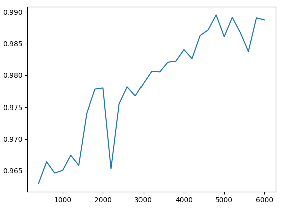

# AB scorer

From a set of images, creates an `image_scores.json` file suitable for training a model (or other use).

```
python image_ab_scorer.py --help
usage: Score a set of images by a series of AB comparisons [-h] -d DIRECTORY [-s SCORES] [-r] [-c CSVFILE] [--lcw LCW] [--height HEIGHT] [--number NUMBER] [--number_to_compare NUMBER_TO_COMPARE] [--k K] [--weight_by_speed] [--default_seconds DEFAULT_SECONDS] [--weight_min WEIGHT_MIN] [--weight_max WEIGHT_MAX]

options:
  -h, --help            show this help message and exit
  -d DIRECTORY, --directory DIRECTORY
                        Top level directory
  -s SCORES, --scores SCORES
                        Filename of scores file (relative to top level directory) from which scores are loaded (if present) and saved
  -r, --restart         Force a restart (don't reload scores file even if present)
  -savefile SAVEFILE
                        Save scores here (relative to top level directory) instead of in the scores file
  --lcw LCW             Weighting priority towards less frequently compared images (0-0.99)
  --height HEIGHT       Height of window
  --number NUMBER       Number of sets of images to compare
  --number_to_compare NUMBER_TO_COMPARE
                        Number of images to choose from
  --k K                 K value for score updates
  --weight_by_speed     Weight fast responses more (see also --default_seconds, --weight_min, --weight_max)
  --default_seconds DEFAULT_SECONDS
                        Typical response time (requires --weight_by_speed)
  --weight_min WEIGHT_MIN
                        Minimum weighting for slow responses (requires --weight_by_speed)
  --weight_max WEIGHT_MAX
                        Maximum weighting for fase responses (requires --weight_by_speed)
```

The only required parameter is `-d DIRECTORY` which should point to a directory holding the images (subdirectories are included).

Click 1 to prefer the left image, 2 to prefer the right image, or q to quit.

At the end of the run, you'll have (in DIRECTORY) a scorefile (`scores.csv`), and a progress scorefile (`scores_200.csv`). There will also be a summary stats line appended to `summary.txt`.

## Comparing and converging

After a few runs you'll have a set of files like
```
scores_200.csv
scores_400.csv
...
scores_1000.csv
```
(note that 100 AB comparisons counts as 200, because we keep track of comparisons per image)

Now you can use `compare_scorefiles.py`:

```
python compare_scorefiles.py --help
usage: Compare a series of scorefiles [-h] -d DIRECTORY [-n] [-s SCORES] [-m MODEL_SCOREFILE]

options:
  -h, --help            show this help message and exit
  -d DIRECTORY, --directory DIRECTORY
                        Top level directory
  -n, --no_plot         Don't show a graph
  -s SCORES, --scores SCORES
                        Filename of scores file (relative to top level directory)
  -m MODEL_SCOREFILE, --model_scorefile MODEL_SCOREFILE
                        Plot comparison with model scorefile
```

Again, you should just need to specify `DIRECTORY` to get a graph like this (this example is for an example which has had lots of runs!):



The x axis is the number of comparisons, and the y axis is the spearman rank correlation between the scores before and after the run. Spearman rank correlation is a measure of how well correlated the _ordering_ of a set of values is. So the images are lined up in order from highest scoring to lowest scoring, before and after the set of AB comparisons, and the ranking is compared. A value of 1 corresponds to the same order, 0 to uncorrelated, and -1 to reversed order.

As you train the database through your AB comparison, you expect the ranking to become gradually more stable as the images get 'sorted out'. If the ranking is changing less during a run, the spearman value will get closer to 1. So you are looking for it to plateau (roughly), as can be seen from around 4000-6000 in this example.

---

# More technical stuff

## File format

The scores file is a json file holding a single python dictionary. The dictionary is of the form:

```python
{
    "ImageRecords": {
        "[imagepath relative to top level directory]": {
            "relative_filepath": "[imagepath relative to top level directory]",  # yes, repeated
            "score": 1.3069393352445966, # the score
            "comparisons": 3 # the number of times this image has been compared
        },
        #...for all images...
    },
    "Metadata": {}
}
```

## Scoring 

The scores are updated using [Elo ratings](https://en.wikipedia.org/wiki/Elo_rating_system) with `k = 0.7`:
```python
        delta = winner.score - loser.score
        p = 1.0/(1.0+math.pow(10,-delta))
        winner.score += (1-p) * k_fac * self.k
        loser.score -= (1-p) * k_fac * self.k
```
`k = 0.7` and `k_fac = 1.0` by default. 

If you set `weight_by_speed` to true, then the speed with which you make your decision will be taken into account - 
quick decisions will be weighted more than slow ones (you had to think, so maybe it's close...). The weighting is
given by `k_fac = default_seconds / time_taken`, with `k_fac` clamped within `(weight_min, weight_max)`.

Default seconds should be your typical decision time (given at the end of each run)

# AB Comparison theory

In theory, a set of N images can be fully ordered in approximately `X=ln(2).N.(ln(N)-1)` comparisons.

_This result can be obtained by considering adding a new image to a set of `n` images. By comparing with an image in the middle, its position can be placed in one half or the other;
so the number of comparisons required is `log2(n)`. Apply a continuum approximation, and the total number of comparisons is given by the integral of `log2(n)` from `n=1` to `n=N`._

So comparisons per image is `X/N = ln(2).(ln(N)-1)`.

|N|X|X/N|
|-|-|-|
|100|250|2.5|
|1000|4100|4.1|
|10000|57000|5.7|
|100000|730000|7.3|

In practice, with human consistency 75-85% (depending on variation in the dataset) this number might be multiplied by 1.5 - 2.0 (allowing each 'wrong' response to be cancelled by an additional right response).

One way of thinking is that each image should be compared `1.5-2 x X/N` times. The stats output at the end of a run will help!